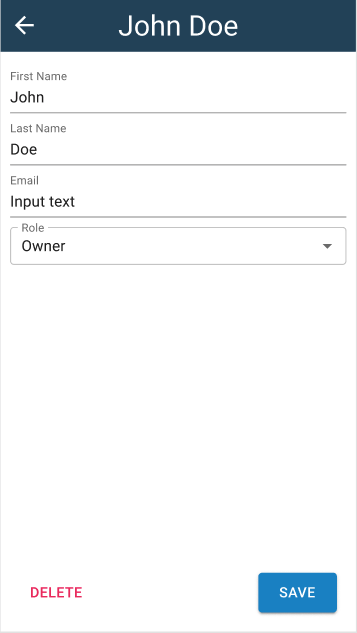

# Test Project (Coding Challenge)
The objective of this project is for us to get to know you better in terms of working together and communicating, as well as it will give us a glimpse of your skillset in building and testing applications. Please read the entire document before you start.

## Instructions:

## Project Details
This project will consist of creating a simple server-side and client-side application. By the end of the project, you will be tasked to dockerize the services to easily set this up on other machines.

### <u>Business Activity</u>
The app will have 2 models. `User` and `Company`. The relationship is a 1:M (1 company, many users). A user cannot be transferred between companies and are only assigned to 1 company. For the model fields, use the mockups found below (the editor pages are the best place to look) to figure out which fields you need.

### <u>Server-Side</u>
Create a very simple app from the ground up (preferably nodejs). You can use whatever framework you want (like ExpressJS but it’s not required).

### <u>Database</u>
Use whatever solution works best for you. A few ideas would be:
* Use something like sqlite or other file-based database
* Use JSON files

### <u>Client-Side</u>
Please use React.js. (You can use Vite to set it up since it’s very fast and quite popular as well. 😉) Please see the mockups below

## ⚠️ Important Notes (Read before you start)
* Your client-side design is NOT required to be the same as the mock-ups. We want to focus more on the functionality, so you can do a minimal design or do what you want with the design.
* It can be a lesser priority but having form validations is a plus.
* Automated testing is encouraged but is not required.
* By the end of the project, dockerize the services so that it’d be easy to run on other systems.
* Please push your code as a monorepository.
* <b>We want to stress that we do not expect you to complete the entire project in under 16 hours. The goal of this test project is to evaluate your skills and abilities and to determine if you would be a good fit for our team.</b>

Good luck! If you have any questions, feel free to reach out to my email on the email thread (<janssenbailio@gmail.com> or <hiroshicacocoro@gmail.com>  )

### Page 1: Companies list

Description: Total counts at the top are counts of the companies (active, in-active, and total). Then list out the companies displaying their name, a count of how many users they have, and their status. Each company should have a link "View Details" that links to their details page (below)

### Page 2: Company Details

> Description: Company name at the very top, then the company address and owner name below that. The "EDIT" button will bring up the Company Editor (Page 3 below), you can do this on its own page with a route or inside of a modal (your choice). The bottom half of the page lists out all of the assigned users for that company. "ADD USER" should bring up the User Editor (Page 4 below) in whatever fashion you decided for the Company Editor (modal vs own page). The pencil icon next to each user should open the User Editor and allow changes to that specific user. "Back" button takes you back to the company's list page.

### Page 3: Company Editor

> Description: Editor page should have both editing existing records and creation of new records using the same UI. Companies should be of status "ACTIVE", when the DELETE button is clicked this should put the company into a status of "INACTIVE". When a company is INACTIVE the "DELETE" button should say "RESTORE" and allow a company to be marked as ACTIVE again.

### Page 4: User Editor:

> Description: Editor page should have both editing existing records and creation of new records using the same UI. The user roles are: (Owner, Admin, Support, Tech). Deleting a user should remove the user from the database (hard delete).
